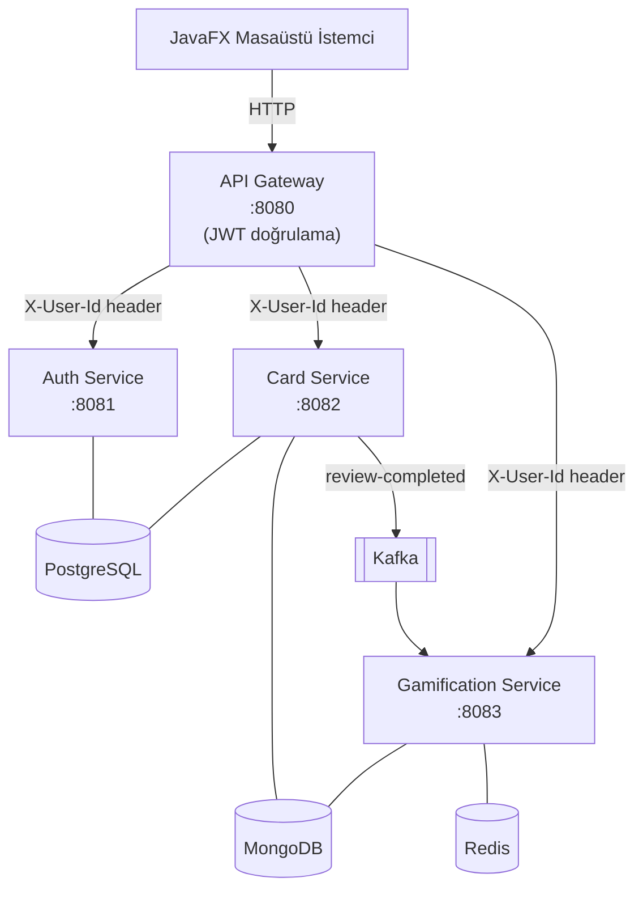
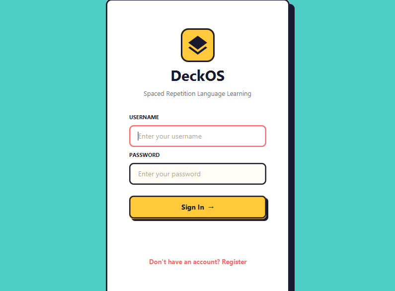
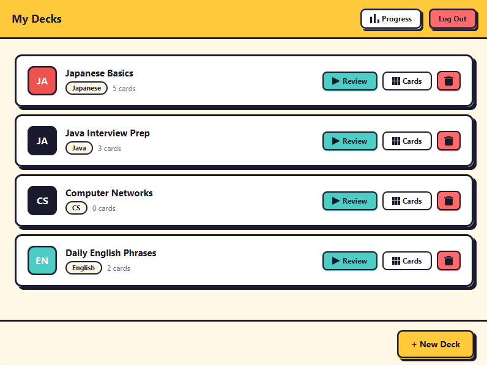
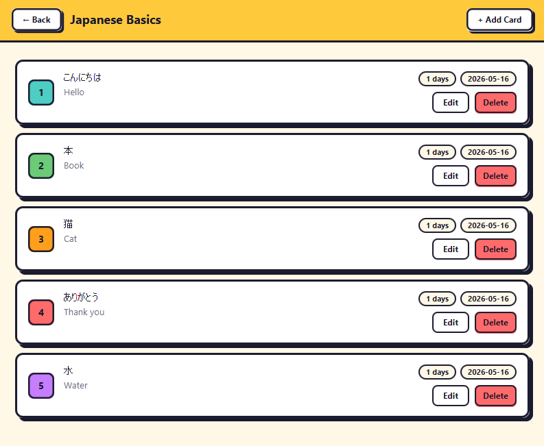
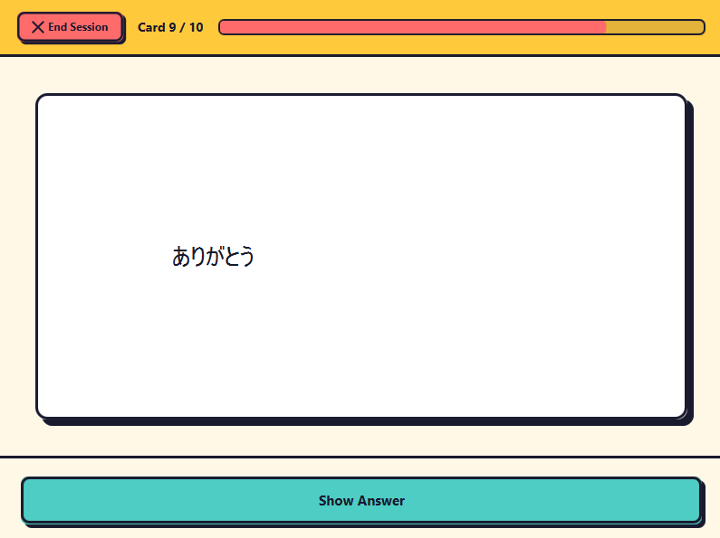
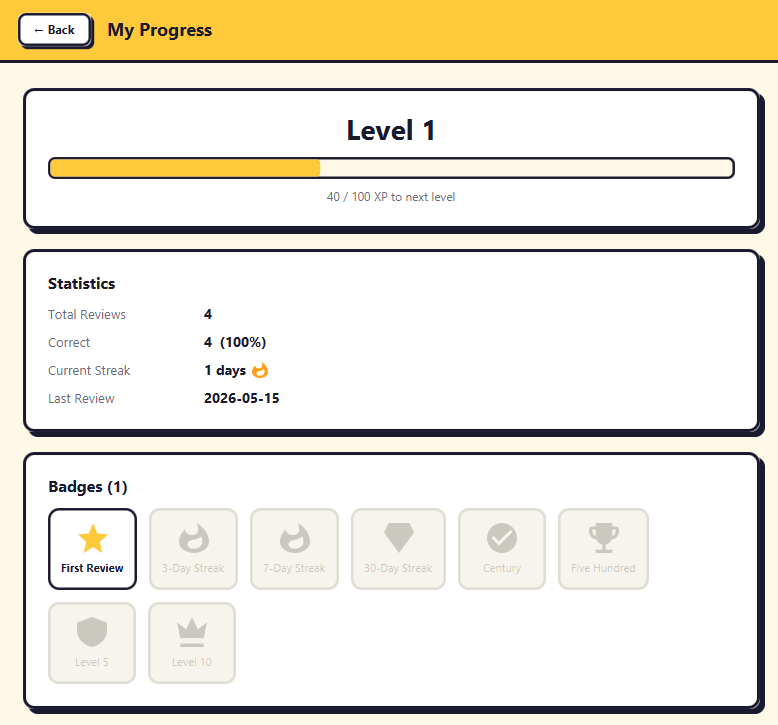

# DeckOS

Aralıklı tekrar (SM-2 algoritması) yöntemiyle dil öğrenmeyi destekleyen, Spring Boot tabanlı mikroservis mimarili bir uygulama. JavaFX masaüstü istemcisi ile birlikte gelir.

---

## Mimari



| Servis               | Port | Veritabanı           |
| -------------------- | ---- | -------------------- |
| API Gateway          | 8080 | —                    |
| Auth Service         | 8081 | PostgreSQL           |
| Card Service         | 8082 | PostgreSQL + MongoDB |
| Gamification Service | 8083 | MongoDB + Redis      |

---

## Teknoloji Yığını

| Katman        | Teknoloji                                     |
| ------------- | --------------------------------------------- |
| Backend       | Java 21, Spring Boot 3.2.5, Spring Cloud 2023 |
| Güvenlik      | Spring Security, jjwt 0.12.5                  |
| Veritabanları | PostgreSQL 16, MongoDB 7, Redis 7             |
| Mesajlaşma    | Apache Kafka (Confluent 7.6)                  |
| Masaüstü GUI  | JavaFX 21 (FXML/MVC)                          |
| Build         | Maven (multi-module)                          |
| Konteyner     | Docker Compose                                |
| Yük Testi     | Apache JMeter 5.6                             |

---

## Başlangıç

### Gereksinimler

- Java 21+
- Maven 3.9+
- Docker Desktop

### Derleme ve Çalıştırma

```bash
# 1. Tüm modülleri derle
mvn clean package -DskipTests

# 2. Altyapı ve servisleri başlat
docker-compose up -d

# 3. Servislerin hazır olmasını bekle (~30 sn)
docker-compose ps
```

### JavaFX İstemcisi

```bash
cd javafx-client
mvn javafx:run
```

---

## API Referansı

Tüm istekler `http://localhost:8080` üzerinden geçer. Kimlik doğrulama gerektiren endpointlere `Authorization: Bearer <token>` header'ı eklenir.

### Auth

| Metod | Endpoint             | Açıklama         | Auth |
| ----- | -------------------- | ---------------- | ---- |
| POST  | `/api/auth/register` | Kullanıcı kaydı  | —    |
| POST  | `/api/auth/login`    | Giriş, JWT döner | —    |

**Kayıt:**

```json
POST /api/auth/register
{ "username": "ali", "email": "ali@example.com", "password": "Sifre123" }
```

**Giriş:**

```json
POST /api/auth/login
{ "username": "ali", "password": "Sifre123" }
```

### Kartlar

| Metod  | Endpoint                    | Açıklama                      |
| ------ | --------------------------- | ----------------------------- |
| GET    | `/api/decks`                | Tüm desteleri listele         |
| POST   | `/api/decks`                | Yeni deste oluştur            |
| DELETE | `/api/decks/{id}`           | Deste sil                     |
| GET    | `/api/decks/{deckId}/cards` | Desteki kartları listele      |
| POST   | `/api/decks/{deckId}/cards` | Yeni kart ekle                |
| PUT    | `/api/cards/{id}`           | Kart güncelle                 |
| DELETE | `/api/cards/{id}`           | Kart sil                      |
| GET    | `/api/cards/due`            | Bugün tekrar edilecek kartlar |
| POST   | `/api/cards/{id}/review`    | Kart değerlendir (SM-2)       |

**Kart değerlendirme:**

```json
POST /api/cards/{id}/review
{ "rating": 4 }
```

> `rating` değerleri: `1` (tekrar) · `2` (zor) · `3` (iyi) · `4` (kolay)

### Gamification

| Metod | Endpoint                        | Açıklama             |
| ----- | ------------------------------- | -------------------- |
| GET   | `/api/gamification/progress`    | XP, seviye, rozetler |
| GET   | `/api/gamification/leaderboard` | İlk 10 kullanıcı     |

---

## Ekran Görüntüleri

<!-- Ekran görüntüsü: Giriş ekranı (login.fxml) -->



<!-- Ekran görüntüsü: Deste listesi (deck-list.fxml) - kart hover efekti ve oluştur/sil dialog -->



<!-- Ekran görüntüsü: Kart inceleme ekranı (card-list.fxml) - TableView, düzenleme formu -->



<!-- Ekran görüntüsü: Tekrar ekranı (review.fxml) - kart çevirme animasyonu, 4 rating butonu -->



<!-- Ekran görüntüsü: İlerleme ekranı (progress.fxml) - XP çubuğu, rozetler, liderboard -->
<!--  -->

---

## Yük Testi

`GET /api/cards/due` endpointi JMeter ile test edilmiştir.

| Parametre       | Değer           |
| --------------- | --------------- |
| Sanal kullanıcı | 50              |
| Ramp-up süresi  | 10 saniye       |
| Toplam istek    | 1.000           |
| Hata oranı      | %0              |
| Ortalama yanıt  | 39 ms           |
| Maks. yanıt     | 237 ms          |
| Verimlilik      | 87 istek/saniye |

Testi tekrar çalıştırmak için:

```powershell
.\jmeter\run-test.ps1
# Parametreli: .\jmeter\run-test.ps1 -Threads 100 -Loops 30
```

---

## SM-2 Algoritması

Her kart değerlendirmesinden sonra bir sonraki tekrar tarihi SM-2 formülüyle hesaplanır:

- **Kolaylık faktörü (EF):** Başlangıç `2.5`, minimum `1.3`
- **Tekrar aralığı:** 1. tekrar → 1 gün · 2. tekrar → 6 gün · sonraki → `aralık × EF`
- `rating < 3` → kart sıfırlanır, ertesi gün tekrar gösterilir

---

## Proje Yapısı

```text
spaced-repetition-language-learning/
├── api-gateway/          # Spring Cloud Gateway, JWT filtre
├── auth-service/         # Kayıt, giriş, JWT üretimi
├── card-service/         # Deste/kart CRUD, SM-2, Kafka producer
├── gamification-service/ # XP, seviye, rozet, streak, liderboard
├── common/               # ApiResponse, GlobalExceptionHandler
├── javafx-client/        # Masaüstü GUI
├── jmeter/               # Yük testi planı ve scripti
├── scripts/              # init-db.sql
└── docker-compose.yml
```
